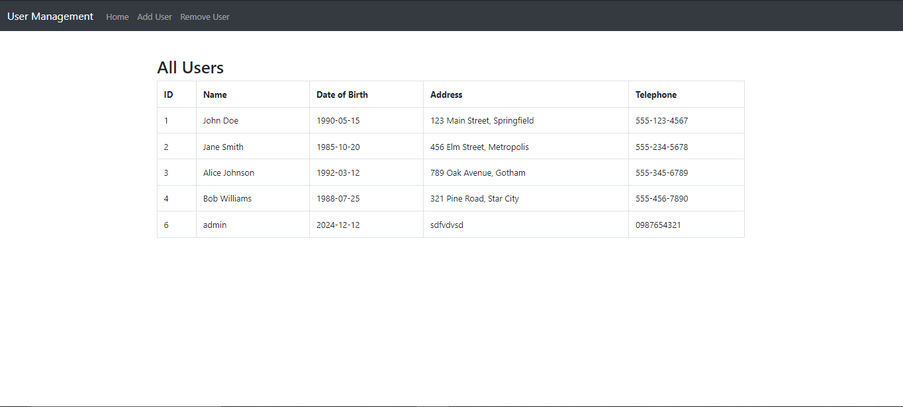
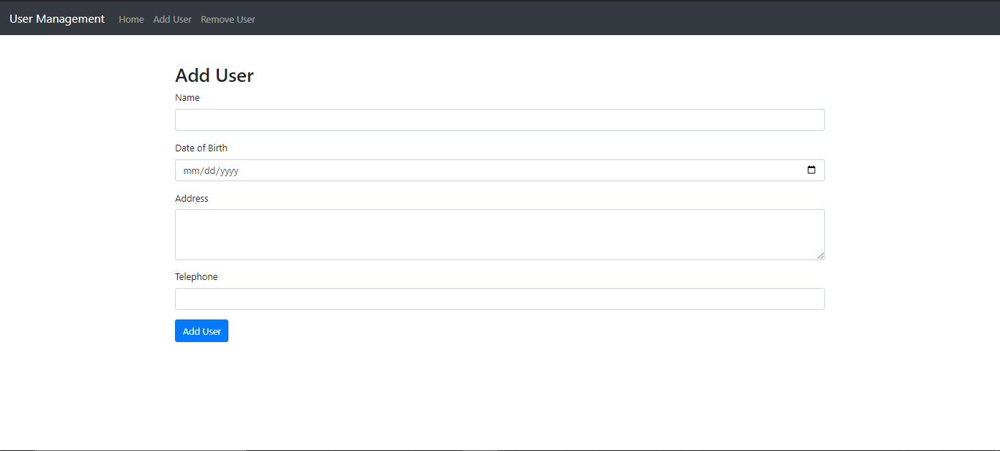
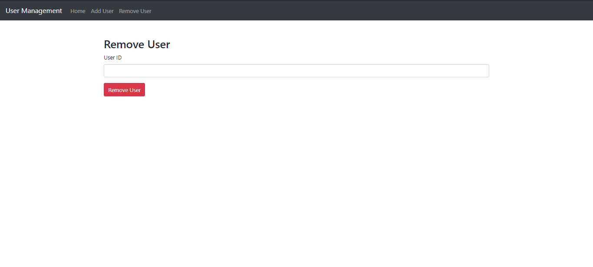

# User_Management_System
A simple PHP-based User Management System that allows you to add, view, and remove users from a MySQL database. The project is built using PHP, MySQL, and styled with Bootstrap for a clean and responsive interface.

<hr>

### Features
1. View Users
    
    Displays all users stored in the database in a tabular format.

    * Page: ``` index.php ```
    * Fetches all user records using a GET request.
    
2. Add User

    Allows adding new users by providing the following details:

    * Name
    * Date of Birth (DOB)
    * Address
    * Telephone
    * Page: ``` add_user.php ```
    * Handles form submission with a POST request to insert data into the database.

3. Remove User

    Enables removing a user by specifying their User ID.

    * Page: ``` remove_user.php ```
    * Deletes the user record from the database using a POST request.

<hr>

### Pages Explanation

1. db.php

    * Contains the database connection details.
    * Reused across all pages for database operations.

2. index.php

    * Displays all users stored in the users table.
    * Fetches data from the database and displays it using a Bootstrap-styled table.

3. add_user.php

    * Shows a form to add new users.
    * Submits form data (Name, DOB, Address, Telephone) via a POST request to insert data into the database.

4. remove_user.php

    * Allows removal of users by entering their User ID.
    * Processes the ID via a POST request to delete the user from the database.

5. navbar.php

    * A reusable navigation bar that links to:
        * Home (View Users)
        * Add User
        * Remove User

<hr>

### Technologies Used

* PHP: Backend scripting language.
* MySQL: Database to store user data.
* Bootstrap: For styling and responsive UI.

<hr>

### Setup Instructions

1. Clone the repository:
    ```git
    git clone https://github.com/your-username/your-repo-name.git
    ```

2. Set up the database:
 * Create a MySQL database and run the following query to create the ```users``` table:
    ```sql
    CREATE TABLE users (
    id INTEGER PRIMARY KEY AUTO_INCREMENT,
    name VARCHAR(100),
    dob DATE,
    address TEXT,
    telephone VARCHAR(50)
    );  
    ```

3. Configure the database connection in ```db.php```:
    ```php
    $host = "localhost";
    $username = "root";
    $password = "";
    $dbname = "your_database_name";
    ```

4. Run the project on a local or remote PHP server (e.g., XAMPP, WAMP, or any web hosting platform).

5. Access the pages:
    * Home: ```http://localhost/index.php```
    * Add User: ```http://localhost/add_user.php```
    * Remove User: ```http://localhost/remove_user.php```

<hr>

### Screenshots

Include screenshots of the interface:
* Home Page (View Users)
    
* Add User Form
    
* Remove User Form
    

